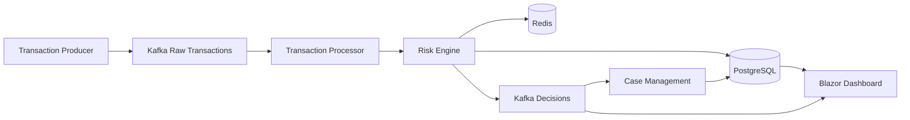
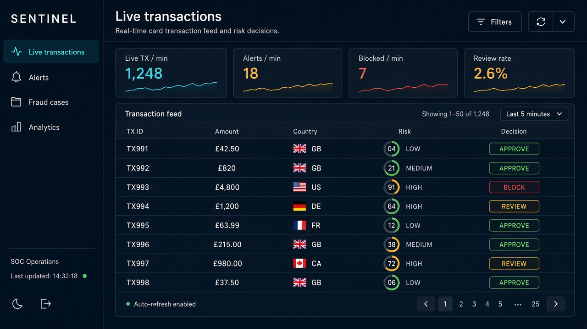
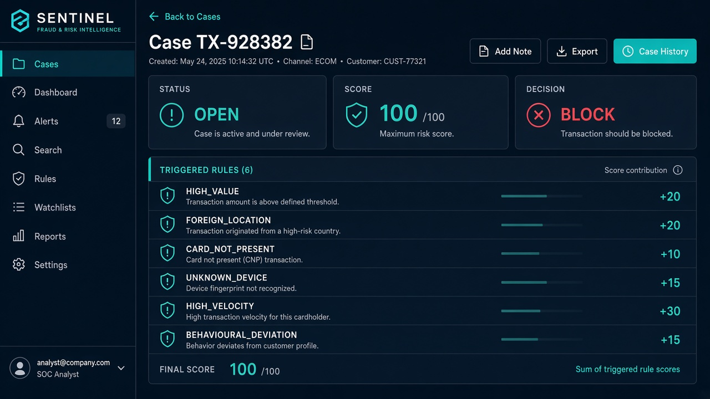

# Sentinel

Real-time transaction monitoring, fraud detection and risk decision platform.

See [FAILURES.md](./FAILURES.md) for what can go wrong, what broke, how it was fixed, and results.

Sentinel is a C# / .NET 10 event-driven system. It ingests card and payment events, scores them with an explainable rules engine, and lets fraud analysts work cases from a Blazor console.

It exists to demonstrate production-shaped distributed systems work: Kafka, Redis velocity, PostgreSQL auditability, idempotent consumers, and a deterministic risk model that a reviewer can step through.

## 60-second tour

1. A transaction enters HTTP ingestion and is published to Kafka.
2. The processor enriches it with Redis velocity and the customer profile.
3. Thirteen independently tested rules produce a capped 0–100 score.
4. APPROVE / REVIEW / BLOCK is persisted with the exact ruleset version used.
5. REVIEW and BLOCK open cases. The Blazor grid updates over SignalR.



## Example decision

Input: `TX-928382`, account `A-91828`, £4,850, US, card not present, unknown device, 7 tx / 5 minutes, typical spend £87.

| Rule | Score |
| --- | --- |
| HIGH_VALUE | +20 |
| FOREIGN_LOCATION | +20 |
| CARD_NOT_PRESENT | +10 |
| UNKNOWN_DEVICE | +15 |
| HIGH_VELOCITY | +30 |
| BEHAVIOURAL_DEVIATION | +15 |
| Raw | 110 |
| Capped | 100 |
| Decision | BLOCK |

That scenario is a unit test in `Sentinel.Domain.Tests`.

## Screenshots

Live operations grid:



Explainable case / decision detail:



## Technology stack

.NET 10, C# 14, ASP.NET Core, EF Core 10, PostgreSQL, Redis, Apache Kafka, Confluent.Kafka, Blazor, SignalR, OpenAPI, OpenTelemetry, .NET Aspire, Docker Compose, xUnit, Testcontainers, optional ML.NET.

## Event pipeline

| Topic | Purpose |
| --- | --- |
| `sentinel.transactions.raw.v1` | Accepted ingress |
| `sentinel.transactions.validated.v1` | Passed validation |
| `sentinel.risk.decisions.v1` | Explainable scores |
| `sentinel.alerts.v1` | REVIEW / BLOCK |
| `sentinel.deadletter.v1` | Poison / exhausted retries |
| `sentinel.profile.updated.v1` | Async profile updates |
| `sentinel.case.feedback.v1` | Analyst labels |

Partition key: `AccountId`.

## Risk engine

Rules implement `IRiskRule` and are independently testable. Decision policy is separate from rule code. Configuration is versioned in PostgreSQL and cached. Historical decisions keep the ruleset they were scored with.

Optional `IRiskModel` (`NoOpRiskModel` by default, `MlNetAnomalyRiskModel` behind a flag) can add at most 15 points when confidence is high.

## Redis

Sorted sets track transactions, spend, distinct merchants, distinct countries and failures across 1m / 5m / 1h / 24h windows with key expiry.

## Database

PostgreSQL stores transactions, immutable risk decisions, ruleset versions, cases, case history, notes, profiles, known devices, audit events, outbox and inbox rows. Indexes are declared in `SentinelDbContext`.

## Running locally

```bash
dotnet restore
dotnet build
dotnet test
dotnet run --project src/Sentinel.AppHost
```

Aspire starts PostgreSQL, Redis, Kafka and every Sentinel process.

## Docker

```bash
docker compose up --build
```

| Surface | URL |
| --- | --- |
| Dashboard | http://localhost:8080 |
| Ingestion API | http://localhost:8081 |
| Cases API | http://localhost:8082 |
| Admin API | http://localhost:8083 |
| Kafka UI | http://localhost:8088 |

Sign in: `analyst@sentinel.local` / `Sentinel!23`

## Demo generator

```bash
dotnet run --project tools/Sentinel.TransactionGenerator -- --mode mixed --rate 20 --endpoint http://localhost:8081/api/v1/transactions
```

Modes: `normal`, `suspicious`, `fraud-burst`, `mixed`.

## Testing

```bash
dotnet test
```

Rule tests cover positive, negative, boundary and edge cases. Integration tests use Testcontainers for PostgreSQL, Redis and Kafka when Docker is available.

## Performance

See `docs/PERFORMANCE.md`. In-process engine latency percentiles are measured in `Sentinel.PerformanceTests`. No unverified throughput claims.

## Security

JWT on APIs, cookie auth on the dashboard, ASP.NET authorization policies for analyst / senior / risk manager / admin / auditor. Privileged changes are audited.

## Observability

OpenTelemetry tracing, metrics and structured logs. Custom meter `Sentinel` emits processed / blocked / review / duration / cases / rule-trigger / error / dead-letter counters. `/health` and `/alive` are mapped on HTTP services.

## Design decisions

Architecture decision records are in `docs/adr/`.

## Roadmap

- Continuous ML training from analyst feedback
- Multi-region velocity
- Card-network ISO 8583 adapter
- Enforced `dotnet format` gate

## Documentation

`docs/ARCHITECTURE.md` · `EVENT_FLOW.md` · `RISK_ENGINE.md` · `RULES.md` · `IDEMPOTENCY.md` · `SECURITY.md` · `PERFORMANCE.md` · `DEMO.md` · `BUILD_PROGRESS.md` · `KNOWN_ISSUES.md`
