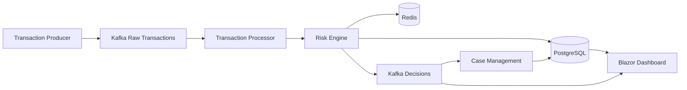

# Architecture

Sentinel is an event-driven fraud decision platform. Transactions are accepted over HTTP, written to Kafka, scored by a deterministic rules engine with Redis velocity context, persisted as immutable decisions in PostgreSQL, and displayed on a Blazor operations console.

## Process boundaries

| Process | Responsibility |
| --- | --- |
| `Sentinel.Ingestion.Api` | Validate inbound HTTP transactions and publish `sentinel.transactions.raw.v1` |
| `Sentinel.TransactionProcessor` | Consume raw events, score, persist, outbox publish |
| `Sentinel.ProfileProcessor` | Update behavioural profiles and known devices |
| `Sentinel.DecisionPublisher` | Open REVIEW/BLOCK cases and fan out to Redis/SignalR |
| `Sentinel.Cases.Api` | Analyst case workflow and feedback events |
| `Sentinel.Admin.Api` | Versioned rulesets, analytics, audit |
| `Sentinel.Web` | Blazor analyst dashboard |

## Design rules

- Money is `decimal` via `Money`.
- Kafka keys are `AccountId` to preserve per-account ordering.
- Decisions are append-only and include the ruleset version used at score time.
- Consumers are idempotent through an inbox table plus a unique decision index on `TransactionId`.
